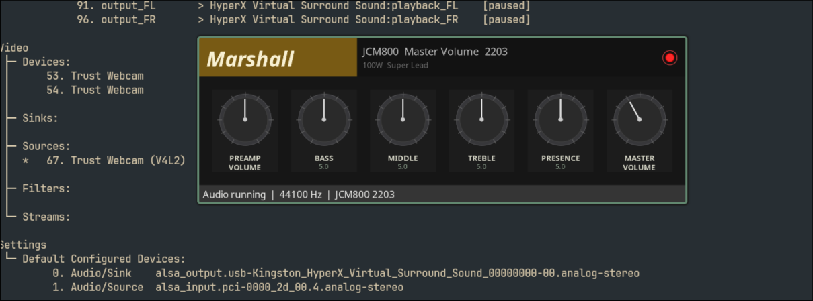

# wx-guitar-amp

A real-time guitar amplifier simulator written from scratch in C++
Models a **Marshall JCM800 2203** - preamp gain staging, passive tone stack, power amp saturation and cabinet simulation, all implemented as hand-written DSP without any effects libraries.



---

## Signal chain
AI gen scheme:
```
              Guitar input (mono)
                    │
                    ▼
┌─────────────────────────────────────────────────────────┐
│  Preamp  (2× 12AX7 triode stages)                       │
│                                                         │
│  DC block → gain stage 1 → asymmetric soft clip         │
│          → gain stage 2 → asymmetric soft clip          │
│          → DC block                                     │
└────────────────────┬────────────────────────────────────┘
                     │
                     ▼
┌─────────────────────────────────────────────────────────┐
│  Passive tone stack  (Marshall 2203 topology)           │
│                                                         │
│  Bass low-shelf (200 Hz)                                │
│  Mid  peaking   (700 Hz, inverted control)              │
│  Treble high-shelf (2.2 kHz)                            │
│  Presence high-shelf (5 kHz)                            │
└────────────────────┬────────────────────────────────────┘
                     │
                     ▼
┌─────────────────────────────────────────────────────────┐
│  Power amp  (EL34 push-pull simulation)                 │
│                                                         │
│  tanh saturation · master volume drives clipping level  │
└────────────────────┬────────────────────────────────────┘
                     │
                     ▼
┌─────────────────────────────────────────────────────────┐
│  Cabinet sim  (4×12 Marshall closed-back)               │
│                                                         │
│  HP 80 Hz · peak 2.2 kHz · LP 6.5 kHz · peak 4.5 kHz    │
└────────────────────┬────────────────────────────────────┘
                     │
                     ▼
              Stereo output
```

---

## Controls

| Knob | Range | What it does |
|---|---|---|
| **Preamp Volume** | 0 – 10 | Input gain into the two cascaded tube stages. Low = clean, mid = crunch, high = full saturation |
| **Bass** | 0 – 10 | Low shelf at 200 Hz, ±12 dB |
| **Middle** | 0 – 10 | Peaking EQ at 700 Hz — **inverted**, like the real circuit. Noon = maximum cut, not boost |
| **Treble** | 0 – 10 | High shelf at 2.2 kHz, ±12 dB |
| **Presence** | 0 – 10 | High shelf at 5 kHz, 0 → +12 dB. Adds bite and aggression |
| **Master Volume** | 0 – 10 | Output level and power amp drive. Higher = more EL34 saturation |

---

## DSP notes

**Biquad filters** — all EQ and simulation stages are second-order IIR filters implemented from scratch using (inspired a lot on) the Audio EQ Cookbook (Bristow-Johnson). State is stored as `double` to prevent precision loss in feedback paths.

**Tube clipping** — uses an asymmetric soft clipper with a slight DC bias before the nonlinearity. This produces even-order harmonics (2nd, 4th) in addition to odd-order ones, which is what gives valve amps their characteristic warmth compared to symmetric transistor clipping.

**Thread safety** — the audio callback runs on a dedicated real-time thread. All parameters are `std::atomic<float>`, written by the UI thread and read lock-free by the audio thread, the filter coefficients are rebuilt inside the audio thread whenever a parameter changes, the state is preserved across rebuilds to prevent clicks.

**Cabinet simulation** - approximated with a chain of four biquads tuned to the frequency response of a Marshall 1960 4x12 with Celestion G12T-75 speakers, loading IR files is on the roadmap.

---

## Building

### Dependencies

- C++17 compiler (GCC 12+ or Clang 15+)
- CMake 3.16+
- wxWidgets 3.2+ (`wxwidgets-gtk3` on Arch)
- miniaudio — included as a single header (`miniaudio.h`)

**Arch Linux (the best):**
```bash
sudo pacman -S wxwidgets-gtk3 cmake base-devel
```

**Ubuntu/Debian:**
```bash
sudo apt install libwxgtk3.2-dev cmake build-essential
```

### Compile

```bash
cmake -S . -B build -DCMAKE_BUILD_TYPE=Release
cmake --build build -- -j$(nproc)
./build/WxGuitarAmp
```

---

## Stack

| Component | Technology |
|---|---|
| UI | [wxWidgets](https://www.wxwidgets.org/) 3.2 |
| Audio I/O | [miniaudio](https://miniaud.io/) (single-header, no dependencies) |
| DSP | Hand-written C++ (no effects libraries) |
| Build | CMake |

---

## License

MIT
