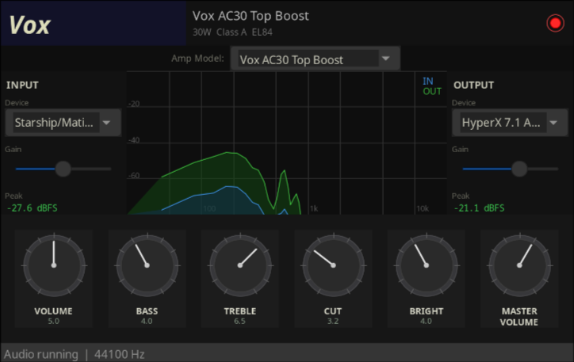

# wx-guitar-amp

Real-time guitar amp simulator in C++. No effects libraries, all DSP written from scratch. Plug in a guitar, pick an amp, play.

Four models so far:

- **Marshall JCM800 2203** - two cascaded 12AX7 stages, inverted mid, EL34 push-pull, 4x12 Greenback
- **Fender Deluxe Reverb '65** - single 12AX7, cubic soft clip, Fender tone stack, 6V6 class A/B, 1x12 Jensen
- **Orange OR120** - cathode-follower asymmetric clip, mid at 900Hz, 4x EL34 at 120W, 4x12 Vintage 30
- **Vox AC30 Top Boost** - class A EL84, inverted CUT control, Celestion Alnico Blue 2x12




## Signal chain

Same stages for all models, different values/clipping/cabinet per model:

```
guitar in (mono)
    |
DC block -> preamp (1 or 2x 12AX7, gain + soft clip)
    |
tone stack (bass/mid/treble biquads, topology varies)
    |
5th control (presence / bright / top boost / CUT)
    |
power amp (tanh saturation, drive scales with master)
    |
cab sim (4-5 biquads, tuned per speaker)
    |
stereo out
```

## Amp models

### Marshall JCM800 2203

Two cascaded gain stages, `x / (1 + |x|)` with a +0.07 DC bias for asymmetric clipping. The mid is **physically inverted** on the real circuit — noon = maximum cut, not flat. At high preamp the two stages compound hard and you get the JCM800 compression.

Knobs: Preamp Volume, Bass, Middle, Treble, Presence, Master Volume

Cab: 4x12 closed-back. HP 80Hz, peak 2.2kHz (+4dB), LP 6.5kHz, peak 4.5kHz (+2dB).

### Fender Deluxe Reverb '65

Single gain stage, cubic clipper `x - x^3/3`. Much more headroom, noon on the volume is still clean. Mid sits at 400Hz and is not inverted. Bright adds a high shelf at 8kHz — same thing the bright cap on the real volume pot does.

Knobs: Volume, Bass, Middle, Treble, Bright, Master Volume

Cab: 1x12 Jensen P12R. HP 65Hz, peak 1.2kHz (+3.5dB), LP 8kHz, peak 3.5kHz (+2.5dB).

### Orange OR120

Asymmetric clip: positive half `x / (1 + x*0.75)`, negative half `x / (1 - x*1.1)`. Mid sits at 900Hz, not inverted. Top Boost simulates the high-gain input jack — extra gain stage plus a 6kHz shelf at once.

Knobs: Volume, Bass, Middle, Treble, Top Boost, Master Volume

Cab: 4x12 Vintage 30. Dip at 250Hz (low-mid suck-out), strong peak at 850Hz — the "honk" on Orange recordings. Five biquads to model it.

### Vox AC30 Top Boost

Class A, 4x EL84 always conducting — no crossover distortion. Preamp clip uses a +0.04 bias (vs Marshall's +0.07), subtler even harmonics, more chime. The **CUT control is inverted** like on the real amp: higher value = darker, not brighter. Passive low-pass from ~12kHz (CUT=0) down to ~600Hz (CUT=10). Bright adds a shelf at 5kHz.

Knobs: Volume, Bass, Treble, Cut, Bright, Master Volume

Cab: 2x12 Celestion Alnico Blue. Peaks at 1.5kHz and 3kHz — very different from the V30's 850Hz honk, which is where the Vox jangle comes from.

## Architecture

Strategy pattern — each amp implements `AmpModel`:

```
process(in, preampVol, bass, mid, treble, ch5, master) -> float
resetState()
name() / brand() / subtitle()
knobLabels() / knobDefaults()
```

```
src/dsp/
    AmpModel.h          <- interface
    Biquad.h            <- second-order IIR
    Fft.h               <- radix-2 Cooley-Tukey
    DspProcessor.h/cpp  <- owns all models, dispatches via atomic<int>
    models/
        JCM800Model.h/cpp
        FenderDeluxeModel.h/cpp
        OrangeOR120Model.h/cpp
        VoxAC30Model.h/cpp
```

`DspProcessor` owns all four instances. On model switch, the audio thread detects the change on the next callback, calls `resetState()` (zeroes biquad state), no locks or allocation in the audio path.

UI thread writes `std::atomic<float>` params, audio thread reads lock-free each callback (~5ms at 44100Hz/256 frames). Filter coefficients rebuild inside the audio thread when a param changes, state is preserved to avoid clicks.

Settings persist to `~/.config/wx-guitar-amp/state.ini` on close. Each model remembers its own knob state.

## UI

Spectrum analyzer: 1024-point FFT, Hanning window, log 20Hz-20kHz axis. Input blue, output green, 20fps.

Device selection: dropdowns from miniaudio enumeration. Change triggers hot restart (device uninit/reinit, context stays alive).

Input/output gain: sliders 0-200%. Peak meters with exponential decay (~300ms), green/yellow/red.

6 knobs with labels and defaults that swap per model.

## Adding a model

1. `src/dsp/models/MyAmpModel.h/cpp` implementing `AmpModel`
2. Add to `DspProcessor.h` (include, member, pointer in `m_models[]`, bump `MODEL_COUNT`)
3. Increment `AMP_MODEL_COUNT` in `src/Persistence.h`
4. Add default preset to `defaults[]` in `src/Persistence.cpp`
5. Add header theme colour to `themes[]` in `src/ui/MainFrame.cpp`
6. Add `.cpp` to `CMakeLists.txt`

## Building

Needs C++17, CMake 3.16+, wxWidgets 3.2+. miniaudio is a single header already included.

```bash
# Arch
sudo pacman -S wxwidgets-gtk3 cmake base-devel

# Ubuntu/Debian
sudo apt install libwxgtk3.2-dev cmake build-essential
```

```bash
cmake -S . -B build -DCMAKE_BUILD_TYPE=Release
cmake --build build -j$(nproc)
./build/WxGuitarAmp
```

## Roadmap

- IR convolution cab sim (load .wav IR files)
- Noise gate
- Delay / spring reverb
- JACK support
- Mesa Boogie Dual Rectifier (silicon diode rectifier, 5 gain stages)

## Stack

- UI: wxWidgets 3.2
- Audio I/O: miniaudio (single header)
- DSP: hand-written C++
- Build: CMake
